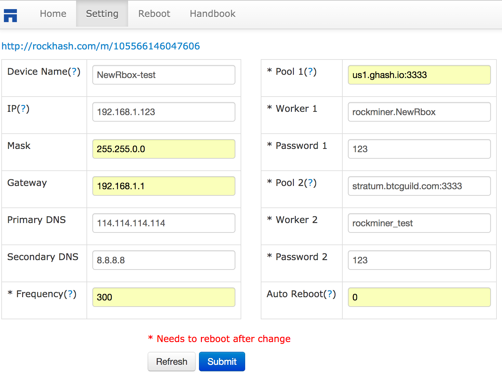

#Handbook for New R-BOX

##Setting

##FAQ

1. What's bitcoin?
	- [https://bitcoin.org/en/faq](https://bitcoin.org/en/faq)
	- [https://www.weusecoins.com/en/](https://www.weusecoins.com/en/)
	
2. What's mining?
	- [https://en.bitcoin.it/wiki/Mining](https://en.bitcoin.it/wiki/Mining)

3. What's pool?	
	- [https://en.bitcoin.it/wiki/Mining_Pool](https://en.bitcoin.it/wiki/Mining_Pool)

4. What's wallet?
	- [https://en.bitcoin.it/wiki/Wallet](https://en.bitcoin.it/wiki/Wallet)
	
5. Pools list
	- [https://ghash.io](https://ghash.io/)
	- [https://www.btcguild.com](https://www.btcguild.com/)
	- [http://eligius.st/~gateway/](http://eligius.st/~gateway/)
	- [https://www.f2pool.com](https://www.f2pool.com/)
	
6. Online Wallets list
	- [https://blockchain.info/wallet/](https://blockchain.info/wallet/)
	- [https://openblock.com/wallet/](https://openblock.com/wallet/)
	